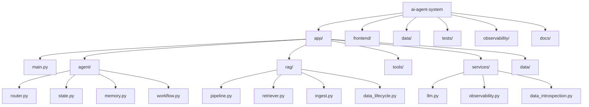

# 🧠 Agentic Conversational AI System - E-commerce Customer Support Agent

[](https://github.com/EntityEbisu/ai-agent-system/actions/workflows/ci.yml)

## 📌 Overview

This project is a **small-scale Agentic Conversational AI system** that simulates a real-world e-commerce customer support assistant, demonstrating production-ready conversational AI with RAG pipeline, order workflows, and observability.

The system simulates a real-world **e-commerce customer support assistant** that can:

* Answer user questions using internal knowledge (**RAG pipeline**)
* Execute a structured **order status workflow**
* Handle **multi-turn conversations with memory**
* Be designed with **scalability, observability, and production-readiness in mind**

---

## 📚 Quick Links

- ⭐ **[Quick Start](QUICK_START.md)** - API examples & feature reference
- 🧪 **[Testing & Verification](TESTING_AND_VERIFICATION.md)** - How to test everything
- 📋 **[Changelog & Status](CHANGELOG.md)** - Version history & current status
- 🏗️ **[Architecture & Flow](PROJECT_FLOW.md)** - Data & system design
- 📊 **[Requirements Mapping](ASSIGNMENT_ALIGNMENT.md)**
- 🚀 **[Deployment Guide](IaC_DOCUMENTATION.md)** - Docker, Render, Railway, AWS
- 📈 **[Data Lifecycle](DATA_LIFECYCLE.md)** - Document versioning & updates

---

## 🎯 Objectives

This project is structured to demonstrate capability across three dimensions:

* **Solution Architecture** → system design, modularity, scalability thinking
* **Engineering** → implementation, APIs, deployment readiness
* **Data & AI** → RAG, memory, data modeling, observability

---

## 🧱 System Architecture

*See [PROJECT_FLOW.md](PROJECT_FLOW.md) for detailed system architecture diagrams and data flow visualization.*

---

## 🧠 Core Concepts

### 🔹 Agent System (Controlled, Not Autonomous)

This project implements a **deterministic agent system**, not a fully autonomous LLM agent.

Key design principles:

* Explicit **routing logic**
* **State machine** for workflows
* LLM used only for generation (not control)

---

### 🔹 Agent State

Each session maintains a structured state:

```python
{
  "intent": None,
  "tool_state": {
    "active": False,
    "step": None,
    "collected": {
      "name": None,
      "ssn_last4": None,
      "dob": None
    }
  },
  "history": []
}
```

---

### 🔹 Tool Workflow (Order Status)

The system implements a **multi-turn workflow**:

```
collect_name
→ collect_ssn
→ collect_dob
→ validate
→ execute_tool
→ reset
```

The agent:

* asks for missing information
* validates user input
* only executes the tool when all fields are collected

---

### 🔹 RAG (Retrieval-Augmented Generation)

Implemented and in validation.

Pipeline:

```
Documents → Chunking → Embedding → Vector Store → Retrieval → LLM
```

Goal:

* Ground responses in internal documents
* Reduce hallucination

Current status:

* Document ingestion works with `data/docs/Company-10k-18pages.pdf`
* Embeddings use HuggingFace and persist into `data/chroma_db`
* Retrieval is supported by Chroma and integrated with the LLM

---

## 🗂️ Project Structure



## 🎨 System Interaction Flow

*See [PROJECT_FLOW.md](PROJECT_FLOW.md) for detailed system interaction flow diagrams and sequence diagrams.*

## 📂 File Map & Purpose

- `app/main.py` - FastAPI backend, chat endpoint, health and metrics endpoints, logging initialization, and message persistence.
- `app/agent/router.py` - Intent classification and routing between order workflow and RAG.
- `app/agent/memory.py` - Session-level state management for multi-turn conversations.
- `app/agent/workflow.py` - Order status workflow slot collection and validation.
- `app/rag/pipeline.py` - Document retrieval and streaming RAG generation.
- `app/rag/retriever.py` - Chroma retriever configuration.
- `app/services/observability.py` - JSON structured logging and in-memory metrics collector.
- `app/data/models.py` - SQLite ORM models for sessions, messages, tool executions, token usage, and metrics.
- `frontend/streamlit_app.py` - Interactive frontend and data explorer for sessions, logs, and RAG documents.
- `tests/setup_db.py` - Initialize SQLite persistence schema.
- `tests/validate_project.py` - End-to-end validation script for key workflows.
- `TESTING_AND_VERIFICATION.md` - Detailed step-by-step testing procedures.
- `PROJECT_FLOW.md` - Text-based data flow and logical architecture diagrams.

---

## 🚀 Current Progress

### ✅ Completed / Implemented (Level 100 - CORE SYSTEM COMPLETE)

* ✅ Project structure
* ✅ Agent state design (deterministic routing, not autonomous)
* ✅ Routing logic (RAG vs Tool vs Fallback)
* ✅ Tool workflow (state machine with slot collection + validation)
* ✅ Session-based memory (in-memory for Level 100)
* ✅ FastAPI endpoint with streaming responses
* ✅ Streamlit data explorer for session, message, document, and log visibility
* ✅ RAG pipeline (document ingestion, chunking, embedding, retrieval)
* ✅ Input validation (SSN format, DOB format)
* ✅ Error handling with graceful fallbacks
* ✅ Validation helper script (`scripts/validate_project.py`)

**Status**: Level 100 requirements fully met. System is a functional prototype ready for demo.

---

### ⏳ Level 200 — Deployment & Operations (Optional Progression)

**Can be implemented using free/local alternatives:**

#### Option 1: Local Docker Deployment (No Cloud Cost)
- **Instead of AWS EC2/Lambda**: Use Docker + Docker Compose locally
- **Instead of CloudFormation**: Use `Dockerfile` + `docker-compose.yml`
- **CI/CD**: GitHub Actions with basic tests and linting (free tier)
- Implementation: Create `Dockerfile`, `docker-compose.yml`, `.github/workflows/ci.yml`

#### Option 2: Free Cloud Tier Deployment
- **Backend**: Deploy to [Render](https://render.com), [Railway](https://railway.app), or [Replit](https://replit.com) (free tier)
- **Vector Store**: Keep Chroma local, backup to GitHub or S3 (AWS free tier for storage)
- **CI/CD**: GitHub Actions (free)

#### Level 200 Deliverables (if implementing):
1. `Dockerfile` for containerizing FastAPI app
2. `docker-compose.yml` for local full-stack (FastAPI + Chroma)
3. `.github/workflows/ci.yml` for basic GitHub Actions pipeline
4. Architecture diagram showing containerized deployment

---

### 🔜 Level 300 — Data & Observability (Optional Progression)

**Can be implemented using free/open-source tools:**

#### 1. Persistent Conversation Data Model
**Instead of in-memory dict → SQLite + SQLAlchemy (free, local)**
```python
# Schema (conceptual)
- Session (id, user_id, created_at, updated_at)
- Message (id, session_id, role, content, timestamp)
- ToolExecution (id, session_id, tool_name, inputs, outputs, timestamp)
```
- **Database**: SQLite (file-based, no server needed)
- **ORM**: SQLAlchemy (free, open-source)
- **Why**: Persists conversations across server restarts, enables multi-session analysis

#### 2. Observability & Logging
**Instead of AWS CloudWatch → Local ELK Stack or simple file logging**
- **Option A (Simple)**: Python `logging` module → log to JSON files → analyze with simple scripts
- **Option B (Richer)**: Docker Compose stack with:
  - Elasticsearch (free, open-source)
  - Kibana (free, open-source)
  - Logstash (free, open-source)
- **Metrics to track**:
  - Request latency (router → retrieval time)
  - Token usage (if available from LLM)
  - Tool execution success rate
  - Error types and frequencies

#### 3. Request Classification Pipeline
**Already partially implemented via `classify()` in router.py**
- Current: Simple keyword matching (order, track, package, etc.)
- Enhanced: Rule-based classifier with regex patterns
- Advanced: Optional LLM-based classification (if budget allows)

#### 4. Data Preprocessing Pipeline
**Improve retrieval quality without additional cost**
- Evaluate chunking strategy (currently 1000 tokens, 200 overlap)
- Test alternative embeddings models (already using `all-MiniLM-L6-v2`)
- Analyze retrieval quality: precision@k, recall metrics
- Script: `scripts/evaluate_retrieval.py`

#### Level 300 Deliverables (if implementing):
1. SQLAlchemy models in `app/data/models.py`
2. Migration script to persist conversations
3. `scripts/setup_db.py` to initialize SQLite
4. Logging config in `app/services/logging.py`
5. Observability design document

---

## 🖥️ Setup & Run

### 1. Create virtual environment

```bash
python3 -m venv venv
source venv/bin/activate
```

---

### 2. Install dependencies

```bash
pip install -r requirements.txt
```

---

### 3. Run backend

```bash
uvicorn app.main:app --reload
```

---

### 4. Test endpoint

Example request:

```json
POST /chat
{
  "session_id": "test123",
  "message": "Where is my order?"
}
```

Use `curl`:

```bash
curl -X POST http://127.0.0.1:8000/chat \
  -H "Content-Type: application/json" \
  -d '{"session_id":"test123","message":"Where is my order?"}'
```

---

### 5. Validate project and Chroma

A helper script is available at `scripts/validate_project.py`.
Run it with:

```bash
python scripts/validate_project.py
```

This script:
* checks Chroma retrieval using the local vector store
* verifies order workflow slot collection and completion
* optionally tests the RAG retrieval path

---

## 🧪 Example Interaction

```
User: Where is my order?
Agent: Please provide your full name.

User: John Doe
Agent: Please provide last 4 digits of your SSN.

User: 1234
Agent: Please provide your date of birth (YYYY-MM-DD).

User: 2000-01-01
Agent: Your order has been shipped and will arrive in 2 days.
```

---

## ☁️ Deployment Strategy (Planned)

* Backend: Dockerized FastAPI service
* Platform: Simple cloud (Render / Railway)
* CI/CD: Basic pipeline (build + lint)

---

## 🧠 Data & Architecture Design (Planned)

### Data Model

* Session
* Messages
* Tool state

### Observability

* Logs: requests, tool usage
* Metrics: latency, success rate
* Tracing: request flow

### Scalability

* Stateless API → horizontal scaling
* Memory → Redis (future)
* Vector DB → separate service

---

## ⚠️ Design Principles

* Keep workflows **deterministic**
* Do not let LLM control system logic
* Separate:

  * routing
  * execution
  * memory
* Optimize for **clarity over complexity**

---

## �️ Architectural Design Decisions & Trade-offs

### **1. Deterministic Agent vs Autonomous LLM Agent**

| Aspect | Deterministic (Chosen) | Autonomous LLM |
|--------|------------------------|-----------------|
| Control Flow | Explicit state machine | LLM decides next step |
| Reliability | ✅ Predictable | ❌ Unpredictable hallucinations |
| Production Readiness | ✅ High | ❌ Risky for financial/security workflows |
| Flexibility | ❌ Limited | ✅ Very flexible |
| Cost | ✅ Lower (fewer LLM calls) | ❌ Higher (many reasoning calls) |

**Decision Rationale**: For e-commerce order verification (involving SSN), deterministic routing prevents LLM from inventing unintended tool calls or missing security checks.

---

### **2. Local Vector Store (Chroma) vs Cloud Vector DB (Pinecone/Weaviate)**

| Aspect | Local Chroma (Chosen) | Cloud Vector DB |
|--------|----------------------|------------------|
| Cost | ✅ Free | ❌ $0.25-1/GB/month |
| Setup Time | ✅ 5 minutes | ❌ API keys, setup |
| Scalability | ⚠️ Limited to machine resources | ✅ Unlimited |
| Latency | ✅ Instant (local) | ❌ Network I/O |
| Data Privacy | ✅ Local, no external API | ❌ Data sent to cloud |

**Decision Rationale**: For prototyping and Level 100, local Chroma is sufficient. Upgrade to Pinecone/Weaviate when dataset > 10GB or latency becomes critical.

---

### **3. HuggingFace Embeddings vs OpenAI Embeddings**

| Aspect | HuggingFace (Chosen) | OpenAI |
|--------|---------------------|--------|
| Cost | ✅ Free (runs locally) | ❌ $0.02-0.13 per 1M tokens |
| API Dependency | ✅ None | ❌ Requires OpenAI key |
| Model Size | 22M params, 1536 dims | 1.5B params, 1536 dims |
| Accuracy | ✅ Sufficient for FAQ/doc retrieval | ✅ Slightly better |
| Cold Start | ✅ ~1s (CPU) | ❌ Network latency |

**Decision Rationale**: HuggingFace embeddings are good enough for document retrieval and cost-free. OpenAI embeddings would be better for semantic similarity tasks but unnecessary for this use case.

---

### **4. In-Memory Sessions vs Persistent Database**

| Aspect | In-Memory (Level 100, Chosen) | Persistent DB (Level 300) |
|--------|-------------------------------|---------------------------|
| Complexity | ✅ Simple | ❌ Complex (migrations, schema) |
| Data Loss | ❌ Lost on restart | ✅ Preserved |
| Scalability | ❌ Single server only | ✅ Multi-server with shared DB |
| Speed | ✅ O(1) lookups | ⚠️ O(1) + network I/O |
| Cost | ✅ Free | ⚠️ $5-100/month (cloud DB) |

**Decision Rationale**: Level 100 uses in-memory for simplicity. Level 300 should migrate to SQLite (free) or PostgreSQL for production.

---

### **5. Synchronous Tool Workflow vs Async Everything**

| Aspect | Sync Workflow (Chosen) | Async Workflow |
|--------|----------------------|-----------------|
| Complexity | ✅ Simple to understand | ❌ Complex with callbacks |
| Ordering Guarantee | ✅ Guaranteed | ✅ Same with proper awaits |
| Error Handling | ✅ Standard try-except | ⚠️ Requires async context managers |
| Performance | ❌ Blocks thread | ✅ Non-blocking |

**Decision Rationale**: Workflow is inherently sequential (ask name → ask SSN → ask DOB). Async unnecessary here. RAG retrieval is async to enable streaming.

---

### **6. OpenRouter LLM vs Direct OpenAI/Gemini**

| Aspect | OpenRouter (Chosen) | OpenAI | Google Gemini |
|--------|-------------------|--------|---------------|
| Cost | ✅ Flexible pricing | ❌ Premium | ✅ Free tier |
| Model Variety | ✅ 100+ models | ❌ Only OpenAI | ✅ Only Gemini |
| Switching Cost | ✅ Zero (one-line change) | N/A | N/A |
| API Compatibility | ✅ OpenAI-compatible | ✅ Native | ❌ Different API |

**Decision Rationale**: OpenRouter enables future switching (e.g., if cost rises or LLM quality improves elsewhere). Single-provider lock-in is risky.

---

## �🎯 Goal

Deliver a **clean, explainable, and extensible agent system** that demonstrates:

* Strong engineering fundamentals
* Clear system design thinking
* Practical understanding of AI systems in production

---

## 📌 Notes

* This project prioritizes **architecture clarity over feature complexity**
* Some components (Level 200–300) are **design-focused with partial implementation**

---

## 📎 Author

Nguyễn Trọng Minh

---
