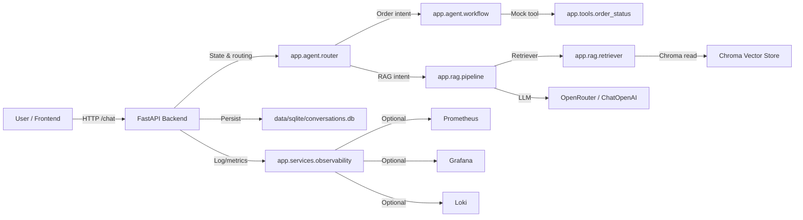

# Architecture Diagram

```mermaid
graph LR
    User[User / Frontend] -->|HTTP /chat| API[FastAPI Backend]
    API -->|State & routing| Router[app.agent.router]
    Router -->|Order intent| Workflow[app.agent.workflow]
    Router -->|RAG intent| RAG[app.rag.pipeline]
    Workflow -->|Mock tool| OrderTool[app.tools.order_status]
    RAG -->|Retriever| Retriever[app.rag.retriever]
    Retriever -->|Chroma read| Chroma[Chroma Vector Store]
    RAG -->|LLM| LLM[OpenRouter / ChatOpenAI]
    API -->|Persist| SQLite[data/sqlite/conversations.db]
    API -->|Log/metrics| Observability[app.services.observability]
    Observability -->|Optional| Prometheus[Prometheus]
    Observability -->|Optional| Grafana[Grafana]
    Observability -->|Optional| Loki[Loki]
```