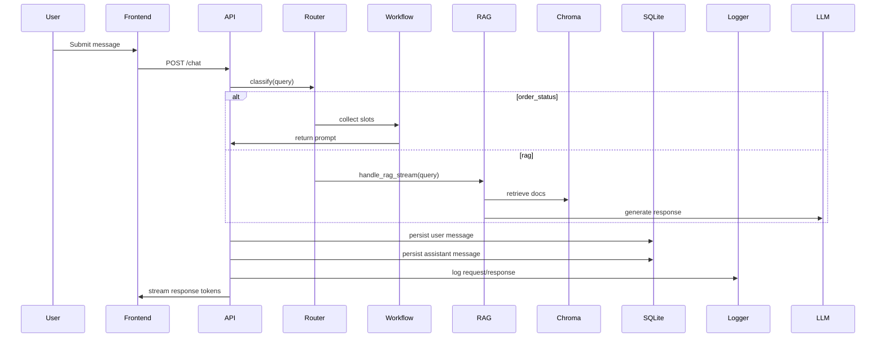

# Data Flow Diagram

```mermaid
sequenceDiagram
    participant User
    participant Frontend
    participant API
    participant Router
    participant Workflow
    participant RAG
    participant Chroma
    participant SQLite
    participant Logger

    User->>Frontend: Submit message
    Frontend->>API: POST /chat
    API->>Router: classify(query)
    alt order_status
        Router->>Workflow: collect slots
        Workflow->>API: return prompt
    else rag
        Router->>RAG: handle_rag_stream(query)
        RAG->>Chroma: retrieve docs
        RAG->>LLM: generate response
    end
    API->>SQLite: persist user message
    API->>SQLite: persist assistant message
    API->>Logger: log request/response
    API->>Frontend: stream response tokens
```