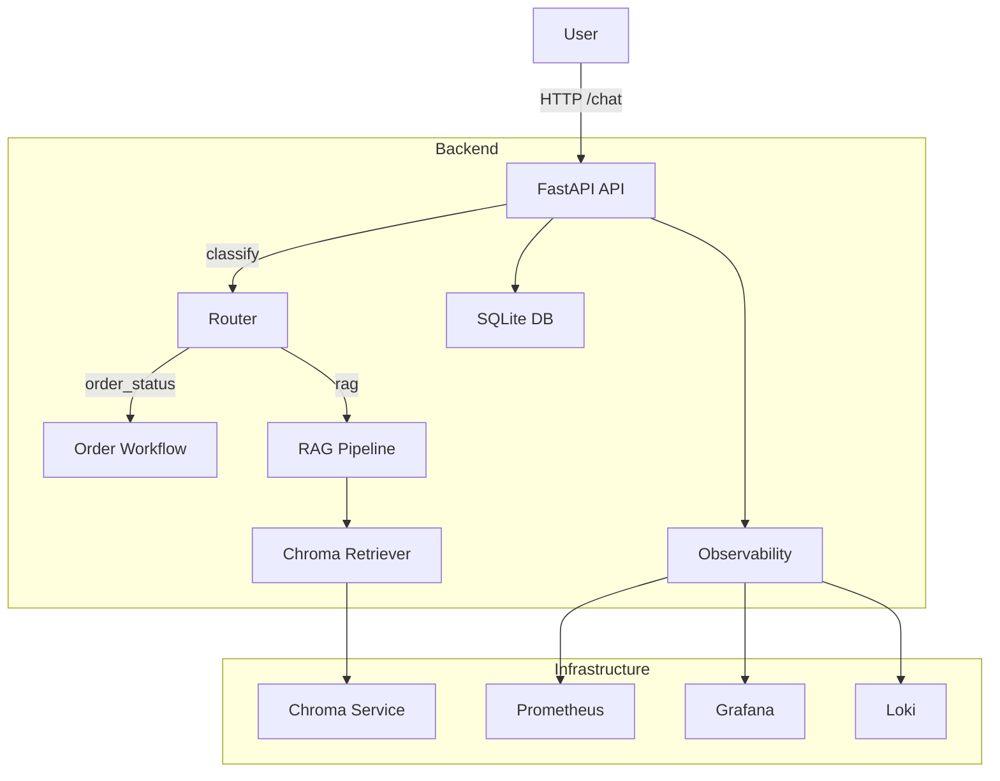

# Service Interactions Diagram

```mermaid
graph TD
    subgraph Backend
        API[FastAPI API]
        Router[Router]
        Workflow[Order Workflow]
        RAG[RAG Pipeline]
        Retriever[Chroma Retriever]
        SQL[SQLite DB]
        Observability[Observability]
    end

    subgraph Infrastructure
        Chroma[Chroma Service]
        Prometheus[Prometheus]
        Grafana[Grafana]
        Loki[Loki]
    end

    User -->|HTTP /chat| API
    API -->|classify| Router
    Router -->|order_status| Workflow
    Router -->|rag| RAG
    RAG --> Retriever
    Retriever --> Chroma
    API --> SQL
    API --> Observability
    Observability --> Prometheus
    Observability --> Grafana
    Observability --> Loki
```